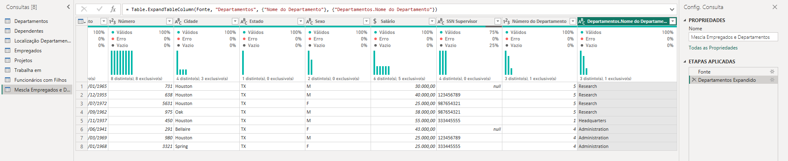

# integracao-limpeza-transformacao-dos-dados-powerbi-dio

# Relatório Financeiro no Power BI

Este repositório tem como objetivo armazenar o projeto desenvolvido no âmbito do desafio de projeto "Criando um Dashboard corporativo com integração com MySQL e Azure" do Bootcamp "Python Data Analytics powered by [Squadio](https://www.squadio.com/home/client)" da [DIO](https://www.dio.me/), sob orientação da professora [Juliana Mascarenhas](https://www.linkedin.com/in/juliana-mascarenhas-ds/).

O projeto é requisito essencial para a aprovação no módulo “Visualização e Análise de dados com Power BI”, consolidando o aprendizado prático dos participantes e preparando-os para os desafios subsequentes.

Este projeto tem como objetivo integrar o Power BI com uma base de dados presente em um banco de dados MySQL, bem como realizar as transformações exigidas no escopo do projeto.

## Objetivos do Projeto

Diretrizes para a integração:

1. Criação de uma instância na Azure para MySQL

2. Criar o Banco de dados com base disponível no github

3. Integração do Power BI com MySQL no Azure

4. Verificar problemas na base a fim de realizar a transformação dos dados

Obs.: Não foi possível realizar a integração dentro da plataforma da Azure devido a cobranças pela criação de um recurso de banco de dados. Houve uma não observância ao fato de que o período de teste dentro da plataforma é válido para o período de 30 dias e apenas uma vez. Como já tinha utilizado meu período de teste, não foi possível utilizar a Nuvem da Microsoft para fazer o projeto.

Diretrizes para transformação dos dados:

1. Verifique os cabeçalhos e tipos de dados

2. Modifique os valores monetários para o tipo double preciso

3. Verifique a existência dos nulos e analise a remoção

4. Os employees com nulos em Super_ssn podem ser os gerentes. Verifique se há algum colaborador sem gerente

5. Verifique se há algum departamento sem gerente

6. Se houver departamento sem gerente, suponha que você possui os dados e preencha as lacunas

7. Verifique o número de horas dos projetos

8. Separar colunas complexas

9. Mesclar consultas employee e departament para criar uma tabela employee com o nome dos departamentos associados aos colaboradores. A mescla terá como base a tabela employee. Fique atento, essa informação influencia no tipo de junção

10. Neste processo elimine as colunas desnecessárias.

11. Realize a junção dos colaboradores e respectivos nomes dos gerentes . Isso pode ser feito com consulta SQL ou pela mescla de tabelas com Power BI. Caso utilize SQL, especifique no README a query utilizada no processo.

12. Mescle as colunas de Nome e Sobrenome para ter apenas uma coluna definindo os nomes dos colaboradores

13. Mescle os nomes de departamentos e localização. Isso fará que cada combinação departamento-local seja único. Isso irá auxiliar na criação do modelo estrela em um módulo futuro.

14. Explique por que, neste caso supracitado, podemos apenas utilizar o mesclar e não o atribuir.

15. Agrupe os dados a fim de saber quantos colaboradores existem por gerente

16. Elimine as colunas desnecessárias, que não serão usadas no relatório, de cada tabela

### Verificando Cabeçalho e Tipo de Dados

Foi alterado o nome das colunas e verificado os tipo dos dados para alcançarmos uma padronização na estrutura.

**Antes:**

  

**Depois:**

  

### Modifique os valores monetários para o tipo double preciso

**Antes:**

  

**Depois:**

  

### Verficando a existência de valores nulos em "SSN Supervisor" da Tabela "Empregados"

Os únicos valores nulos encontrados nas consultas do Power Query são referentes a coluna "SSN Supervisor" da Tabela "Empregados".

Esses valores nulos se devem ao fato de que o empregados que tem "SSN Supervisor" vazio, estão no topo da hierarquia profissional da empresa.

  

### Verificando se há algum departamento sem gerente

Todos os departamentos possuem gerentes pelo que é possível analisar da tabela "Departamentos".

  

### Verificando o número de horas dos projetos

**Número de Hora dos Projetos:**

  

Para realizarmos a soma total podemos utilizar o próprio Power Query para fazer o cálculo:

  

### Separando Colunas Complexas

**Antes:**

  

**Depois:**

  

### Mesclando consultas "Empregados" e "Departamentos"

**Mescla Tabela "Empregados" e "Departamentos":**

  

### Mesclando consultas "Empregados" e Nomes dos Supervisores

**Mescla Tabela "Empregados" e Coluna "SSN Supervisor":**

  

### Mesclando as colunas de Nome e Sobrenome

**Antes:**

  

**Depois:**

  

### Mesclando os nomes de departamentos e localização

Nesse caso foi necessário utilizar o recurso do Power Query denominado "Mesclar Consultas como Novas" para criar uma nova consulta baseada na tabela da esquerda que foi a "Localização Departamentos". Esse processo é semelhante ao "left join" que utilizamos em SQL.

  

### Agrupando os dados a fim de saber quantos colaboradores existem por gerente

  

## Tecnologias Utilizadas

- Microsoft Power BI

## Contribuições

Contribuições são bem-vindas. Sinta-se à vontade para sugerir melhorias e possíveis correções para o código por meio de uma issue ou pull requests.

## Author

Jadeson Bruno Albuquerque da Silva

